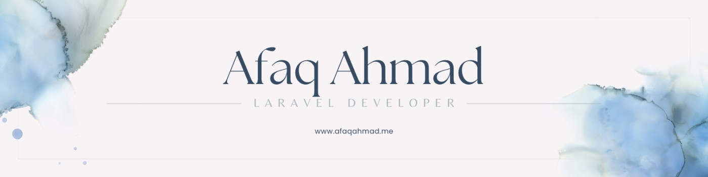

🔭 I’m currently working on refining my skills across the full-stack spectrum, diving into modern frameworks, and enhancing my knowledge of software architecture. 🌱 I’m currently learning modern frameworks, Linux systems, and DevOps practices to enhance my full-stack capabilities. 📈 I’m exploring strategies for improving application scalability and performance. 🔍 I’m interested in engaging with projects that leverage cutting-edge technologies and best practices. 💬 Ask me about Laravel, modern tech stacks, software architecture, and anything related to web development. 📫 How to reach me hi@afaqahmad.me 

# 💻 Tech Stack:
             

### Github Stats

## 🌐 Socials:

  

# 📊 GitHub Stats:
 
 

### 🔝 Top Contributed Repo

---

<!-- Proudly created with GPRM ( https://gprm.itsvg.in ) -->
